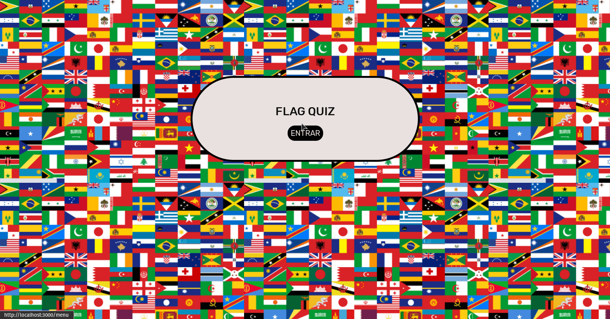
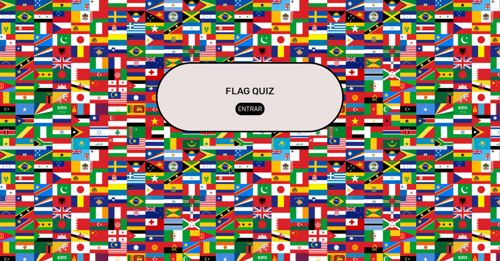
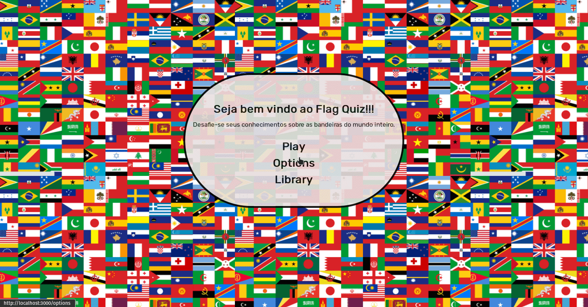

<h1 align="center">
Flag Quiz
</h1>

### Olá desafiante, seja bem muito bem vindo as Flag Quiz!. Aqui você sera capaz em colocar em prática seus conhecimentos sobre todas as bandeiras de países e territórios.

<h1 align="center">

</h1>

# Descrição

#### Desenvolvido para usuário praticar tudo o que sabe sobre bandeiras mundias. A aplicação trará uma quantidade de bandeiras para resolver em um _QUIZ_. Com base na _BANDEIRA_ que está sendo renderizado, em qual das 4 alternativas o nome da bandeira é a correta.

# Clonar projeto para sua maquina
1. verifique se você esta branch `main` ou `master`.

  * utilize esse comando no seu terminal para verificar: `git branch`.
  * Caso esteja na branch informada vá para o proximo passo, caso não esteja execute este comando:

  `git checkout main` ou `git checkout master`

2. Clonando repositório.

* Click no botão `Code` e copie a url `SSH`.
* Caso preferir copie esse url: `git@github.com:PedroPDIN/Flag-Quiz-Project.git`.
* Após isso no seu terminal execute o comando `git clone` e logo em seguida a **url** do projeto:
> Exemplo: `git clone git@github.com:PedroPDIN/Flag-Quiz-Project.git`

3. Instalando as Dependências

* Entre na pasta do repositório que você acabou de clonar:
 `cd Flag-quiz-project`

* Acesse a pasta do projeto com o comando: `cd flag-quiz-project/`.
* Logo após isso execute o comando `npm install` para instalar as dependências.

4. Criando branch a partir da `master` ou `main`.
* Verifique que você esta na brach `master` ou `main`. (para verificar basta seguir as instruções no passo 1).
* Com isso basta executar o comando `git checkout -b 'nome-da-brach-flag-quiz'`.

Exemplo: `git checkout -b pedro-lima-flag-quiz`
> Criará uma branch e acessa-lá logo em seguida graças o tag "-b"

* Voilá


# Tela inicial

<h1 align="center">

</h1>

> Página inicial que terá o título e o botão de entra no Flag Quiz.

# Tela de Menu

<h1 align="center">

</h1>

> Aqui o usuário poderá jogar o Quiz clicando no botão "Play", configurar a quantidade de bandeiras e selecionar uma "lista" de bandeiras que usuário preferir acessando a "Options" e por fim ter curiosidades de saber todas as bandeiras do quiz acessando a opção "Library".

# Tela Library

<h1 align="center">

</h1>

> Possui todas as informações de bandeiras que terá no Quiz.

# Tela Options

<h1 align="center">

</h1>

> Aqui o usuário "se preferir" poderá selecionar a quantidade de bandeiras para resolver (10, 20, 30, 50, 100, 200), por padrão o quantidade possui-rá 20 e filtrar uma "lista" de bandeiras com base nos continentes (África, Américas, Ásia, Europa, Oceania).

> E o botão salvar, que será responsável por salvar as alterações feitas pelo o usuário.

# Tela Play

<h1 align="center">

</h1>

> Aqui é a parte do Quiz em que o desafiante irá responder a uma pergunta, QUAL É ESSA BANDEIRA?.

> Com isso, o desafiante terá que selecionar a uma única resposta correta entre 4 alternativas

> Também poderá acompanhar o "resolved" que são as perguntas resolvidas, configurado (nas Options) ou não (Lembrando que por padrão terá 20).

> OBS: Caso o desafiante não filtre as bandeiras na opção "Options", o Quiz terá bandeiras aleatórias de todos os continentes e a quantidade de bandeiras padrão.

# Tela Result

<h1 align="center">

</h1>

> Aqui o desafiante irá verificar o resultado final, contendo os acertos e também os erros. E, também uma breve mensagem de acordo com o resultado.

# Ferramentas, Bibliotecas e Linguagens utilizadas.

- [Javascript](https://devdocs.io/javascript/)
- [React](https://pt-br.reactjs.org/docs/getting-started.html)
- [React-Redux](https://react-redux.js.org/)
- [CSS](https://www.w3schools.com/cssref/)
- [API - Rest Countries](https://restcountries.com/)

# React-Redux

#### Na aplicação foi utilizada a biblioteca Redux para armazenar no estado global, as quantidades e filtros configurado pelo o desafiante. Além, também de armazenar o resultado final do Quiz (acertos e erros).

- Estrutura da quantidades e filtros configurado:

```
const INIT = {
  number: '20',
  flags: '',
}
```

**OBS**: como citado nos tópicos anteriores a quantidade padrão inicial é 20.

- Estrutura do resultado final do Quiz:

```
const INIT = {
    hits: 0,
    wrong: 0,
}
```

# API - Rest Countries

#### Retorna apenas informações de cada países do mundo, a API possui duas versões de _endpoint_ (v2 e v3). Nesse caso a versão utilizada foi **Versão 2**, pois essa versão especifica retorna os dados mais legível para o Quiz.

- _**endpoint**_ utilizado:

`https://restcountries.com/v2/all`

- _**endpoint**_ retorno:

```
[
  {
    "name": "Brazil",
    "topLevelDomain": [
      ".br"
    ],
    "alpha2Code": "BR",
    "alpha3Code": "BRA",
    "callingCodes": [
    "55"
    ],
    "capital": "Brasília",
    "altSpellings": [
      "BR",
      "Brasil",
      "Federative Republic of Brazil",
      "República Federativa do Brasil"
    ],
    "subregion": "South America",
    "region": "Americas",
    "population": 212559409,
    "latlng": [
      -10.0,
      -55.0
    ],
    "demonym": "Brazilian",
    "area": 8515767.0,
    "gini": 53.4,
    "timezones": [
      "UTC-05:00",
      "UTC-04:00",
      "UTC-03:00",
      "UTC-02:00"
    ],
    "borders": [
      "ARG",
      "BOL",
      "COL",
      "FRA",
      "GUF",
      "GUY",
      "PRY",
      "PER",
      "SUR",
      "URY",
      "VEN"
    ],
    "nativeName": "Brasil",
    "numericCode": "076",
    "flags": {
      "svg": "https://flagcdn.com/br.svg",
      "png": "https://flagcdn.com/w320/br.png"
    },
    "currencies": [
    {
      "code": "BRL",
      "name": "Brazilian real",
      "symbol": "R$"
    }
    ],
    "languages": [
      {
        "iso639_1": "pt",
        "iso639_2": "por",
        "name": "Portuguese",
        "nativeName": "Português"
      }
    ],
    "translations": {
      "br": "Brasil",
      "pt": "Brasil",
      "nl": "Brazilië",
      "hr": "Brazil",
      "fa": "برزیل",
      "de": "Brasilien",
      "es": "Brasil",
      "fr": "Brésil",
      "ja": "ブラジル",
      "it": "Brasile",
      "hu": "Brazília"
    },
    "flag": "https://flagcdn.com/br.svg",
    "regionalBlocs": [
      {
        "acronym": "USAN",
        "name": "Union of South American Nations",
        "otherAcronyms": [
          "UNASUR",
          "UNASUL",
          "UZAN"
        ],
        "otherNames": [
          "Unión de Naciones Suramericanas",
          "União de Nações Sul-Americanas",
          "Unie van Zuid-Amerikaanse Naties",
          "South American Union"
        ]
      }
    ],
    "cioc": "BRA",
    "independent": true
  },
    ...
    ...
    ...
]

```
## Possíveis, futuras funcionalidades e melhorias

* Tela de Raking
* Melhoras a questão de "Carregamento". A cada mudança de caminho nas páginas, possuir um tempo de carregamento, para evitar "possíveis" problemas de assicronisidade.
